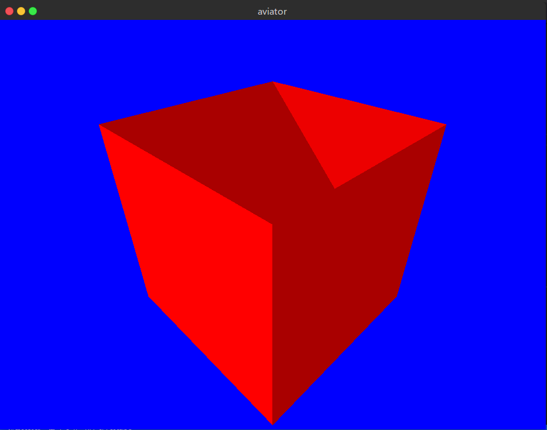

# 用Rust写一个飞行员游戏-01

学习glium也有一个多月了, 于是写了个demo练手, 基本思路是借(chao)鉴(xi)了这篇文章: **[使用 Three.js 的 3D 制作动画场景：飞行者](https://zhuanlan.zhihu.com/p/21341483).**

### 01. 立方体

首先我们要创建1个立方体结构, 用来组成飞机以及云.  

不过glium并没有自动创建立方体的功能, 我们要自己写一个.  

首先, 创建一个顶点的结构体: 

```
#[derive(Copy, Clone)]
pub struct Position{
    pub position: [f32; 3]
}
implement_vertex!(Position, position); // 这个宏用来让结构体可以被顶点缓冲使用
```

接着, 创建一个立方体的结构体:  

```
pub struct Cube {
    vertex_buffer: glium::VertexBuffer<Position>, // 顶点缓冲
    index_buffer: glium::IndexBuffer<u16>,              // 索引缓冲
    color: [f32; 3],                                    // 颜色
}
```

顶点缓冲里保存了立方体的所有顶点, 索引缓冲则是OpenGL绘制这些顶点的顺序. 同时, 结构体还有一个 *color* 成员, 它将作为一个 *uniform* 变量, 在绘制的时候传递给着色器.  

以下是该结构体的方法:  

```
impl Cube {
    // 这个方法用来返回一个默认的立方体对象
    pub fn new(display: &glium::Display) -> Cube {
        let shape = vec![
            // 一共六个面, 每个面上4个顶点
            // 前
            Position {position: [-0.5, 0.5, -0.5]},  // 0
            Position {position: [0.5, 0.5, -0.5]},   // 1
            Position {position: [0.5, -0.5, -0.5]},  // 2
            Position {position: [-0.5, -0.5, -0.5]},   // 3
            // 左
            Position {position: [0.5, 0.5, -0.5]},   // 4
            Position {position: [0.5, 0.5, 0.5]},   // 5
            Position {position: [0.5, -0.5, 0.5]},   // 6
            Position {position: [0.5, -0.5, -0.5]},  // 7
            // 后
            Position {position: [0.5, 0.5, 0.5]},   // 8
            Position {position: [-0.5, 0.5, 0.5]},   // 9
            Position {position: [-0.5, -0.5, 0.5]},   // 10
            Position {position: [0.5, -0.5, 0.5]},   // 11
            // 右
            Position {position: [-0.5, 0.5, 0.5]},   // 12
            Position {position: [-0.5, 0.5, -0.5]},  // 13
            Position {position: [-0.5, -0.5, -0.5]},   // 14
            Position {position: [-0.5, -0.5, 0.5]},   // 15
            // 上
            Position {position: [-0.5, 0.5, 0.5]},   // 16
            Position {position: [0.5, 0.5, 0.5]},   // 17
            Position {position: [0.5, 0.5, -0.5]},   // 18
            Position {position: [-0.5, 0.5, -0.5]},  // 19
            // 下
            Position {position: [-0.5, -0.5, -0.5]},   // 20
            Position {position: [0.5, -0.5, -0.5]},  // 21
            Position {position: [-0.5, -0.5, 0.5]},   // 22
            Position {position: [0.5, -0.5, 0.5]},   // 23
        ];
        return Cube {
            vertex_buffer: glium::VertexBuffer::new(display, &shape).unwrap(),
            index_buffer: glium::IndexBuffer::new(display, glium::index::PrimitiveType::TrianglesList,
                &[0, 1, 2, 2, 3, 0, 4, 5, 6, 6, 7, 4, 8, 9, 10, 10, 11, 8,12,13,14,14,15,12,16,17,18,18,19,16,20,21,22,22,23,20,],).unwrap(),
            color: [1.0, 0.0, 0.0f32],
        }
    }

    // 这个方法将立方体绘制到帧缓冲中
    pub fn draw(&self,
        target: &mut glium::Frame, 
        program: &glium::Program,)
    {
        // 设置uniform变量
        let uniform = uniform! {
            object_color: self.color
        };
        target.draw(
                    &self.vertex_buffer,
                    &self.index_buffer,
                    program, 
                    uniforms,
                    &Default::default()
        ).unwrap();
    }
}
```

这样, 立方体结构体就有了一个 *new* 方法, 用于返回一个新建的立方体对象: 它是一个红色的立方体, 边长为1, 且位于屏幕正中央.  
以及一个 *draw* 方法, 在帧缓冲中绘制立方体.  

还需要创建一个顶点着色器和片段着色器, 用来链接编译一个着色器程序:  

```
// 着色器代码
let vs_str: &str = r#"
    #version 330

    layout(location = 0) in vec3 position;

    uniform vec3 object_color;

    out vec3 color;

    void main() {
        color = object_color;
        gl_Position = vec4(position, 1.0);
    }
"#;
let fs_str: &str = r#"
    #version 330
    in vec3 color;
    out vec4 frag_color;

    void main() {
        frag_color = vec4(color, 1.0);
    }
"#;

// 创建着色器程序
let program = glium::Program::from_source(&display, vs_str, fs_str, None).unwrap();
```

以上就是全部准备工作, 接着运行代码:  


可能和预计的不大一致. 首先, 屏幕上的不是一个立方体, 而是一个矩形. 另外, 这个立方体的长和宽应该是相等的, 但是屏幕上所显示的长和宽不相等.  

一切都是因为没有透视.  

其实, 如果想做一个2D的游戏, 这样的图形就已经足够了. 但是 *飞行者* 这个游戏是3D的, 因此还需要为其添加透视.  

glium指南里的透视代码直接扒下来就能用了. 具体请参考 **[这里](https://github.com/glium/glium/blob/master/book/tuto-10-perspective.md).**  

顺便把glium指南里的 *观察* 矩阵的代码也扒下来, 然后调整好观察的角度:  

以下为添加了透视后的结果:  


**[本部分源码]()**

### 02. 光照 

因为立方体各个面的颜色都是一样的, 所以上面显示的结果看上去就像一个六边形.  

一切都是因为没有光照.  

为了添加光照, 首先要为立方体的每个顶点添加法线. 如何使用法线计算光照, glium指南的 **[tuto-08-gouraud](https://github.com/glium/glium/blob/master/book/tuto-08-gouraud.md)** 一节有着详细的介绍.  

首先, 和顶点类似, 先在代码中添加一个法线的结构体:  

```
// 法线向量
#[derive(Copy, Clone)]
pub struct Normal{
    pub normal: [f32; 3]
}
implement_vertex!(Normal, normal);
```

同时, 在立方体结构体中添加用于保存法线的顶点缓冲:  

```
pub struct Cube {
    vertex_buffer: glium::VertexBuffer<geom::Position>, // 顶点缓冲
    normal_buffer: glium::VertexBuffer<Normal>,         // 顶点缓冲, 保存每个顶点的法线向量
    index_buffer: glium::IndexBuffer<u16>,              // 索引缓冲
    color: [f32; 3],                                    // 颜色
}
```

接着, 计算立方体每个面上各个顶点的法线向量:  

```
// 立方体每个面上的各个顶点的法线向量其实是一样的.  
let mut normals: Vec<Normal> = Vec::new();
for index in 0..24 {
    if index < 4 {
        normals.push(Normal {normal: [0.0, 0.0, -1.0]});
    }
    else if index < 8 {
        normals.push(Normal {normal: [1.0, 0.0, 0.0]});
    }
    else if index < 12 {
        normals.push(Normal {normal: [0.0, 0.0, 1.0]});
    }
    else if index < 16 {
        normals.push(Normal {normal: [-1.0, 0.0, 0.0]});
    }
    else if index < 20 {
        normals.push(Normal {normal: [0.0, 1.0, 0.0]});
    }
    else {
        normals.push(Normal {normal: [0.0, -1.0, 0.0]});
    }
}
```

最后修改着色器, 在其中添加处理光照的代码.  

顶点着色器:  

```
#version 330

layout(location = 0) in vec3 position;
layout(location = 1) in vec3 normal;

uniform vec3 object_color;
uniform mat4 view;
uniform mat4 perspective;

out vec3 v_color;
out vec3 v_normal;

void main() {
    v_color = object_color;
    v_normal = normal;

    gl_Position = perspective*view*vec4(position, 1.0);
}
```

片段着色器:  

```
#version 330
in vec3 v_color;
in vec3 v_normal;

out vec4 color;

// 在这里设置光线的方向和颜色
vec3 lightDir = normalize(vec3(1.0, 2.0, 0.0));
vec3 lightColor = vec3(1.0, 1.0, 1.0);

void main() {
    // 环境光
    float ambientStrength = 0.4; // 设置环境光的强度
    vec3 ambient = ambientStrength * lightColor;

    // 漫反射光
    vec3 norm = normalize(v_normal);
    float diff = max(dot(norm, lightDir), 0.0); // 计算漫反射光的强度
    vec3 diffuse = diff * lightColor;

    // 输出颜色
    vec3 result = (ambient + diffuse) * v_color;
    color = vec4(result, 1.0);
}
```

有多种不同类型的光照, 在这里只使用环境光和漫反射光

添加光照之后的结果如下显示:  



上图中并没有显示正确的颜色. 因为没有开启深度测试.  

要开启深度测试, 只需要在 *draw* 方法中添加参数: 

```
...
// 创建绘制参数
let params: glium::draw_parameters::DrawParameters = Default::default();    // 创建一个绘制参数
params.depth = glium::Depth {
    test: glium::draw_parameters::DepthTest::IfLessOrEqual,
    write: true,
    ..Default::default()
};
target.draw(
            (&self.vertex_buffer, &self.normal_buffer),
            &self.index_buffer,
            program, 
            &uniforms,
            &params
).unwrap();
...
```

现在的结果:  


看上去好多了.  

**[本部分源码]()**
 
### 03. 立方体组合

有了一个基本的立方体之后, 就能用它来组成各种复杂的图形. 在原文中, 飞机和云朵都是由数个立方体组合成的.  

为了做到这一点, 要先对立方体结构体进行一些修改.  

首先, 立方体的长, 宽, 高, 位置, 旋转角度等属性不能是固定的, 在需要时应当可以进行修改.  

这里使用矩阵对立方体的各个属性进行修改. 有关矩阵变换的内容, 可以参考 **[这里](https://learnopengl-cn.github.io/01%20Getting%20started/07%20Transformations/#_13).**

首先, 为立方体添加 *位置* *旋转* *尺寸* 三个矩阵:  

```
pub struct Cube {
    vertex_buffer: glium::VertexBuffer<Position>, // 顶点缓冲
    normal_buffer: glium::VertexBuffer<Normal>, // 保存法线的顶点缓冲
    index_buffer: glium::IndexBuffer<u16>,      // 索引缓冲
    position: [[f32;4];4],                      // 位置坐标矩阵
    rotate: [[f32;4];4],                        // 旋转矩阵
    scale: [[f32;4];4],                         // 尺寸矩阵
    color: [f32; 3],                            // 颜色
}
```

然后为立方体结构体添加修改它们的方法:  

```
// 设置尺寸
pub fn set_scale(&mut self, x: f32, y: f32, z: f32) {
    self.scale = [
        [x, 0.0, 0.0, 0.0],
        [0.0, y, 0.0, 0.0],
        [0.0, 0.0, z, 0.0],
        [0.0, 0.0, 0.0, 1.0f32],
    ]
}
// 设置旋转
// 简单起见(其实是不会), 这里直接规定图形只能绕x, y或z轴旋转
pub fn set_rotate(&mut self, angle: f32, xyz: i32) {
    self.rotate = if xyz==0 {
        // 沿x轴旋转
        [[1.0, 0.0, 0.0, 0.0],
            [0.0, angle.cos(), angle.sin(), 0.0],
            [0.0, -angle.sin(), angle.cos(), 0.0],
            [0.0, 0.0, 0.0, 1.0]]
    } else if xyz==1 {
        // 绕y轴旋转
        [[angle.cos(), 0.0, -angle.sin(), 0.0],
            [0.0, 1.0, 0.0, 0.0],
            [angle.sin(), 0.0, angle.cos(), 0.0],
            [0.0, 0.0, 0.0, 1.0]]
    } else if xyz==2 {
        // 绕z轴旋转
        [[angle.cos(), angle.sin(), 0.0, 0.0],
            [-angle.sin(), angle.cos(), 0.0, 0.0],
            [0.0, 0.0, 1.0, 0.0],
            [0.0, 0.0, 0.0, 1.0]]
    } else {
        [[1.0, 0.0, 0.0, 0.0],
            [0.0, 1.0, 0.0, 0.0],
            [0.0, 0.0, 1.0, 0.0],
            [0.0, 0.0, 0.0, 1.0]]
    };
}
// 设置位置
pub fn set_position(&mut self, x: f32, y: f32, z: f32) {
    self.position = [[1.0, 0.0, 0.0, 0.0],
            [0.0, 1.0, 0.0, 0.0],
            [0.0, 0.0, 1.0, 0.0],
            [x, y, z, 1.0f32]];
}
```

同时在 *new* 方法里也要添加对应的初始化语句, 在默认的情况下 将这些矩阵都初始化为单位矩阵:  

```
...
// 统一初始化为单位矩阵
let initmatrix: [[f32; 4]; 4] = [ [1.0, 0.0, 0.0, 0.0],
                        [0.0, 1.0, 0.0, 0.0],
                        [0.0, 0.0, 1.0, 0.0],
                        [0.0, 0.0, 0.0, 1.0f32]]; 
return Cube {
    vertex_buffer: glium::VertexBuffer::new(display, &shape).unwrap(),
    normal_buffer: glium::VertexBuffer::new(display, &normals).unwrap(),
    index_buffer: glium::IndexBuffer::new(display, glium::index::PrimitiveType::TrianglesList,
        &[0, 1, 2, 2, 3, 0, 4, 5, 6, 6, 7, 4, 8, 9, 10, 10, 11, 8,12,13,14,14,15,12,16,17,18,18,19,16,20,21,22,22,23,20,],).unwrap(),
    position: initmatrix,
    rotate: initmatrix,
    scale: initmatrix, 
    color: [1.0, 1.0, 1.0f32],
}
...
```

这样, 在绘制的时候, 就能用uniform变量将这三个矩阵传递给着色器, 着色器再用它们对顶点坐标进行运算. 运算公式是这样的:  

```
最终的顶点坐标 = 尺寸矩阵 * 旋转矩阵 * 位置矩阵 * 顶点坐标
```

当然, 也可以先把 尺寸矩阵 * 旋转矩阵 * 位置矩阵 的值算好, 再把结果传递给着色器. 矩阵乘法是满足结合律的.  

这样做需要自己先实现一个矩阵的乘法.  

```
// 矩阵乘法
fn matrix_multi(first: &[[f32; 4]; 4], second: &[[f32; 4]; 4]) -> [[f32; 4]; 4] {
    let mut a: [[f32; 4]; 4] = [[0.0; 4]; 4];
    for i in 0..4 {
        for k in 0..4 {
            let r:f32 = first[i][k];
            for j in 0..4 {
                a[i][j] += r*second[k][j];
            }
        }
    }
    return a;
}
```

然后在绘制的时候先计算结果:  

```
...
let model: [[f32; 4]; 4] = 
            matrix_multi(&self.scale, &self.rotate);
let model = 
    matrix_multi(&model, &self.position);  // 计算矩阵乘法的结果
let uniforms = uniform! {
    object_color: self.color, 
    view: *view,
    perspective: *perspective,
    model: model,    // 新加一个uniform变量
};
...
```

最后是顶点着色器部分:  

```
#version 330

layout(location = 0) in vec3 position;
layout(location = 1) in vec3 normal;

uniform vec3 object_color;
uniform mat4 view;
uniform mat4 perspective;
uniform mat4 model;

out vec3 v_color;
out vec3 v_normal;

void main() {
    v_color = object_color;
    v_normal = normal;
    gl_Position = perspective*view*model*vec4(position, 1.0);
}
```

这样就能修改立方体的属性了:

```
...
let mut newcube = Cube::new(&display);
newcube.set_color(1.0, 1.0, 0.0);
newcube.set_scale(0.1, 1.0, 1.0);
newcube.set_position(1.0, 0.0, 0.0);
...
```

结果如下图所示:


接着, 就是将立方体组合起来的部分了.  

首先, 创建一个 *飞机* 结构体:  

```
pub struct Plane {
    // 飞机由以下6部分组成(每个部分都是一个立方体)
    wing: Cube,         // 机翼
    cockpit: Cube,      // 机舱
    engine: Cube,       // 引擎
    propeller: Cube,    // 螺旋浆
    matblade: Cube,     // 叶片
    tail: Cube,         // 机尾
    position: [[f32; 4]; 4],
    rotate: [[f32; 4]; 4],
    scale: [[f32; 4]; 4],
}
```

初始化方法:  

```
pub fn new(display: &glium::Display) -> Plane {
    // 设置飞机的各个部件
    // 设置机舱
    let mut cockpit = Cube::new(display);
    cockpit.set_scale(1.2, 1.0, 1.0);
    cockpit.set_color(0.95, 0.33, 0.27);
    // 设置引擎
    let mut engine = Cube::new(display);
    engine.set_scale(0.4, 1.0, 1.0);
    engine.set_position(0.8, 0.0, 0.0);
    engine.set_color(0.85, 0.82, 0.82);
    // 设置机尾
    let mut tail = Cube::new(display);
    tail.set_scale(0.3, 0.4, 0.1);
    tail.set_position(-0.7, 0.5, 0.0);
    tail.set_color(0.95, 0.33, 0.27);
    // 设置机翼
    let mut wing = Cube::new(display);
    wing.set_scale(0.8, 0.16, 3.0);
    wing.set_color(0.95, 0.33, 0.27);
    // 设置螺旋浆
    let mut propeller = Cube::new(display);
    propeller.set_scale(0.4, 0.2, 0.2);
    propeller.set_position(1.2, 0.0, 0.0);
    propeller.set_color(0.35, 0.20, 0.18);
    // 设置叶片
    let mut matblade = Cube::new(display);
    matblade.set_scale(0.02, 2.0, 0.4);
    matblade.set_position(1.2, 0.0, 0.0);
    matblade.set_color(0.14, 0.10, 0.06);

    let initmatrix = [[1.0, 0.0, 0.0, 0.0],
                        [0.0, 1.0, 0.0, 0.0],
                        [0.0, 0.0, 1.0, 0.0],
                        [0.0, 0.0, 0.0, 1.0f32]];
    Plane {
        cockpit, engine, tail, wing, propeller, matblade, 
        position: initmatrix,
        rotate: initmatrix,
        scale: initmatrix,
    }
}
```

这样, 就在坐标原点绘制好了一架蠢蠢的飞机, 不过如果想要移动或者旋转飞机的时候, 就需要对飞机内每个部件都进行同样的操作.  

可以把飞机内部视为一个坐标系, 飞机内部件的变换都是在这个坐标系内进行的. 如果想要对飞机进行变换, 例如, 缩放, 移动, 旋转, 只需要对这个坐标系进行操作就可以了.  

这样在绘制时, 首先对飞机内部的坐标系进行相对世界坐标的变换, 然后再对飞机内部的部件进行相对于内部坐标系的变换.  

因此需要在立方体结构体中添加一个矩阵 *pmodel*, 用来表示 *父坐标系* 的变换.

对于普通的立方体, *pmodel* 表示世界坐标系的变换, 对于飞机内部的立方体, 其表示飞机的变换.  

```
pub struct Cube {
    vertex_buffer: glium::VertexBuffer<Position>, // 顶点缓冲
    normal_buffer: glium::VertexBuffer<Normal>,
    index_buffer: glium::IndexBuffer<u16>,      // 索引缓冲
    position: [[f32;4];4],                      // 位置坐标矩阵
    rotate: [[f32;4];4],                        // 旋转矩阵
    scale: [[f32;4];4],                         // 尺寸矩阵
    pmodel: [[f32;4];4],                        // 父节点模型矩阵
    color: [f32; 3],                            // 颜色
}
```

同时, 在绘制时:  

```
...
// 首先进行父坐标系的变换, 再进行自身的变换
let model: [[f32; 4]; 4] = 
    matrix_multi(&self.scale, &matrix_multi(&self.rotate, &matrix_multi(&self.position, &self.pmodel)));
...
```

飞机结构体也有一个绘制方法, 依次调用子部件的绘制方法:  

```
pub fn draw(&mut self, 
    target: &mut glium::Frame, 
    program: &glium::Program,
    view: &[[f32; 4]; 4],
    perspective: &[[f32; 4]; 4],) 
{
    // 通过自身的矩阵计算出内部坐标系变换的model矩阵
    let model: [[f32; 4]; 4] = 
        matrix_multi(&self.scale, &matrix_multi(&self.rotate, &self.position));
    // 将model矩阵传递给每个部件
    self.wing.set_pmodel(&model); 
    self.wing.draw(target, program, view, perspective);
    self.cockpit.set_pmodel(&model);
    self.cockpit.draw(target, program, view, perspective);
    self.engine.set_pmodel(&model);
    self.engine.draw(target, program, view, perspective);
    self.tail.set_pmodel(&model);
    self.tail.draw(target, program, view, perspective);
    self.propeller.set_pmodel(&model);
    self.propeller.draw(target, program, view, perspective);
    self.matblade.set_pmodel(&model);
    self.matblade.draw(target, program, view, perspective);
}
```

结果如下图所示:  


**[本部分源码]()**

### 04. 圆柱体

写一个圆柱体的步骤和立方体类似. 只不过圆柱体的顶点数比较多, 因此其顶点的计算和顶点的绘制顺序更加复杂.  

首先, 列举出圆柱体的全部顶点:  

```
...
let mut vertex: Vec<Position> = Vec::new();
for i in 0..40 {
    let angle: f32 = std::f32::consts::PI / 20.0 * i as f32;
    for z in -5..6 {
        let x: f32 = angle.cos();
        let y: f32 = angle.sin();
        vertex.push(Position {position: [x, y, 0.1 * z as f32]});
    }
}
...
```

按照原文, 将圆柱体的半径分段40, 高分段10, 一共有440个顶点.  

然后, 按照每三个相邻顶点组成1个三角形的规律, 创建顶点缓冲:  

```
let mut shape: Vec<Position> = Vec::new();
for i in 0..40 {
    for index in 0..10 {
        let first = index + i*11;
        if i==39 {
            // 正面
            shape.push(vertex[index+1]);
            shape.push(vertex[first+1]);
            shape.push(vertex[first]);
            // 反面
            shape.push(vertex[first]);
            shape.push(vertex[index]);
            shape.push(vertex[index+1]);
        }
        else {
            // 正面
            shape.push(vertex[first+12]);
            shape.push(vertex[first+1]);
            shape.push(vertex[first]);
            // 反面
            shape.push(vertex[first]);
            shape.push(vertex[first+11]);
            shape.push(vertex[first+12]);
        }
    }
}
```

然后计算出每个三角形中, 三个顶点的法线向量:  

```
let mut normals: Vec<Normal> = Vec::new();
// 一共600个三角形
for i in 0..800 {
    // 每个三角形3个顶点
    let a:[f32; 3] = [shape[i*3+1].position[0]-shape[i*3].position[0], shape[i*3+1].position[1]-shape[i*3].position[1], shape[i*3+1].position[2]-shape[i*3].position[2]];
    let b:[f32; 3] = [shape[i*3+2].position[0]-shape[i*3+1].position[0], shape[i*3+2].position[1]-shape[i*3+1].position[1], shape[i*3+2].position[2]-shape[i*3+1].position[2]];
    // 求个叉乘
    let normal:[f32; 3] = [a[1]*b[2]-a[2]*b[1], a[2]*b[0]-a[0]*b[2], a[0]*b[1]-a[1]*b[0]];
    for _j in 0..3 {
        normals.push(Normal {normal});
    }
}
```

之后的绘制操作, 变换操作都和立方体结构体一致, 这里不再赘述.  

结果如下:  


另外, 原文中还实现了海浪波动的效果, 这里也给加上.  

实现方法和原文中一致.  

在创建顶点的同时, 为每个顶点保存一个随机的旋转半径, 旋转角度和旋转速度

```
...
let mut vertex: Vec<Position> = Vec::new();
let mut index = 0;
let mut waves:[[f32; 3]; 440]=[[0.0; 3]; 440];
for i in 0..40 {
    let angle: f32 = std::f32::consts::PI / 20.0 * i as f32;
    for z in -5..6 {
        let x: f32 = angle.cos();
        let y: f32 = angle.sin();
        vertex.push(Position {position: [x, y, 0.1 * z as f32]});
        waves[index] = [
            rand::random::<f32>() * std::f32::consts::PI * 2.0,     // 随机角度
            0.01 + rand::random::<f32>() * 0.03,                    // 随机距离
            0.016 +  rand::random::<f32>() * 0.032                  // 转动角度
        ];
        index+=1;
    }
}
...
```

然后在每次绘制时, 重新计算每个顶点的位置:  

```
let mut new_vertex: Vec<Position> = Vec::new();
for index in 0..440 {
    let x: f32 = self.vertex[index].position[0];
    let x: f32 = x + self.waves[index][0].cos() * self.waves[index][1];
    let y: f32 = self.vertex[index].position[1];
    let y: f32 = y + self.waves[index][0].sin() * self.waves[index][1];
    let z: f32 = self.vertex[index].position[2];
    new_vertex.push(Position{position:[x, y, z]}); // 每次绘制时, 顶点的位置都不同
    self.waves[index][0] += self.waves[index][2];
}
```

之后, 需要重新生成顶点和法线的顶点缓冲.  


最后还有一点, 如果你发现你像我一样, 发现设置的颜色和最终在屏幕上显示的颜色不一致. 那么是glium的锅.  

glium默认开启Gamma校正(有关Gamma校正的内容, 可以参考 **[这篇回答](https://www.zhihu.com/question/27467127/answer/37555901)**), 总之就是glium会把颜色做一个(1/2.2)的幂运算.  

要关闭Gamma校正, 需要修改创建着色器程序的代码.

之前我们是这样创建的:  

```
let program = glium::Program::from_source(&display, vs_str, fs_str, None).unwrap();
```

现在我们用 *new* 方法:  

```
let sourcecode = glium::program::ProgramCreationInput::SourceCode {
    vertex_shader: vs_str,
    tessellation_control_shader: None,  // 没用到的属性直接设为None
    tessellation_evaluation_shader: None,
    geometry_shader: None,
    fragment_shader: fs_str,
    transform_feedback_varyings: None,
    outputs_srgb: true,     // 这个属性默认是false, 即开启Gamma校正, 我们将其设为true
    uses_point_size: true,
};
let program = glium::Program::new(&display, sourcecode).unwrap();
```

现在颜色正常了:  


**[本部分源码]()**