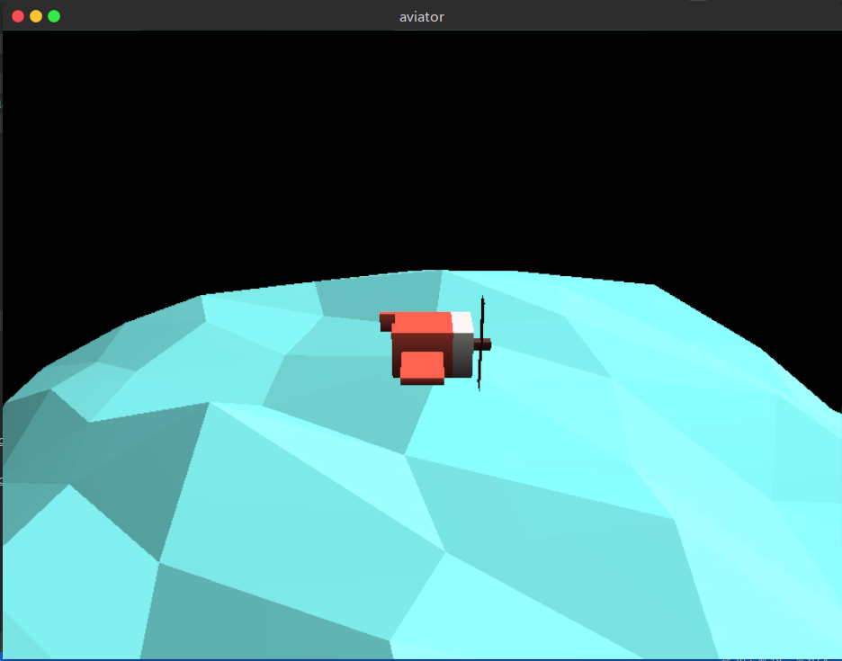
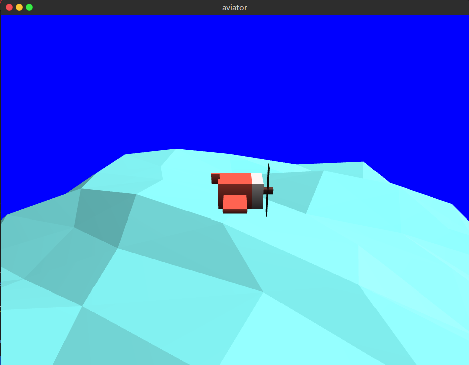

# 用Rust写一个飞行员游戏-02

接着来写飞行员游戏.  

开始之前, 先把 *main.rs* 拆分成不同的文件, 单个文件的代码太长, 修改起来会很麻烦(当然也可以只写到一个文件里).  

### 01. 帧缓冲

帧缓冲是屏幕所显示画面的一个直接映像, 整个帧缓冲对应一帧图像.  

有关帧缓冲的内容, 可以参考 **[这里](https://learnopengl-cn.github.io/04%20Advanced%20OpenGL/05%20Framebuffers/)**. 接下来, 我们将按照上面链接文章里的思路, 把图像绘制到自定义的帧缓冲中, 再把帧缓冲渲染到纹理上, 然后把纹理贴到一个横跨整个屏幕的四边形上.  

之前一直都在用glium的默认帧缓冲:  

```
let mut target= display.draw();
```

帧缓冲由保存片段颜色信息的颜色缓冲, 保存片段深度信息的深度缓冲以及之前没用到的可以根据条件丢弃特定片段的模板缓冲组成.  

一个帧缓冲至少要有一个颜色缓冲, 同时因为我们在绘制图形时还进行了深度检测, 因此还需要附加一个深度缓冲.  

因此先创建两个纹理, 这两个纹理将被附加到我们创建的帧缓冲上, 在OpenGL绘制帧缓冲时, 颜色和深度信息会分别写入到这两个纹理中:    

```
// 创建保存颜色信息的纹理
let color_texture = glium::texture::srgb_texture2d::SrgbTexture2d::empty(&display, 800, 600).unwrap();
// 创建保存深度信息的纹理
let depth_texture = glium::texture::depth_texture2d::DepthTexture2d::empty(&display, 800, 600).unwrap();
```

之后创建帧缓冲:  

```
// 创建一个附加了颜色和深度附件的帧缓冲
let mut frame_buffer = glium::framebuffer::SimpleFrameBuffer::with_depth_buffer(&display, &color_texture, &depth_texture).unwrap();
// 清理帧缓冲的颜色和深度信息
frame_buffer.clear_color_and_depth((0.0, 0.0, 0.0, 1.0), 1.0);
```

同时, 要想把上一节创建的物体绘制到该帧缓冲上, 首先要修改每个物体的 *draw* 方法:  

```
pub fn draw<S>(&self,
    target: &mut S,     // 将参数类型改成实现了trait glium::Surface 的类型
    program: &glium::Program,
    view: &[[f32; 4]; 4],
    perspective: &[[f32; 4]; 4],)
where
    S: glium::Surface,
```

之后将参数指定为我们新建的帧缓冲:    

```
airplane.draw(&mut frame_buffer, &program, &view_camera.view, &view_camera.perspective);
sea.wave(&display);
sea.draw(&mut frame_buffer, &program, &view_camera.view, &view_camera.perspective);
```

这样就完成了. 为了将保存颜色的纹理显示到屏幕上, 首先需要创建一个横跨整个屏幕的四边形.   

这个四边形上要贴纹理, 因此这里新建一个顶点结构体:  

```
#[derive(Copy, Clone)]
struct Vertex{
    position: [f32; 3], // 顶点坐标
    texcoord: [f32; 2], // 纹理坐标
}
implement_vertex!(Vertex, position, texcoord);
```

之后的步骤和立方体结构体一致, 不过该四边形绘制所需的着色器不同:  

顶点着色器代码:  

```
#version 330
layout(location = 0) in vec3 position;
layout(location = 1) in vec2 texcoord;

out vec2 v_tex_coords;

void main() {
    v_tex_coords = texcoord;
    gl_Position = vec4(position, 1.0);
}
```

片段着色器代码:

```
#version 330

in vec2 v_tex_coords;
out vec4 FragColor;

uniform sampler2D screen_texture;   // 将纹理作为uniform变量传入

void main() {
    FragColor = texture(screen_texture, v_tex_coords);
}
```

最后的结果如下图所示:  



### 02. 抗锯齿

如果是用的默认的帧缓冲, 可以通过修改默认的 *context* 开启MSAA来消除锯齿:  

```
let context = glium::glutin::ContextBuilder::new()
                .with_depth_buffer(24)
                .with_srgb(true)
                .with_multisampling(4); // 只需添加这一句
```

效果如下:  



如果使用的是自建的帧缓冲, 

### 03. 阴影

### 04. 雾